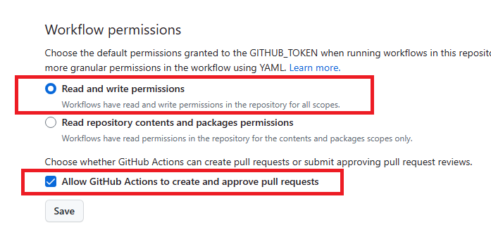

#  Julia TagBot

TagBot creates tags, releases, and changelogs for your Julia packages when they're registered.

When we talk about tags and releases, we mean *Git tags* and *GitHub releases*, and not releases in a registry that allow the Julia package manager to install your package.
TagBot does not register your package for you, see the documentation in [General](https://github.com/JuliaRegistries/General/blob/master/README.md) and [Registrator](https://github.com/JuliaRegistries/Registrator.jl/blob/master/README.md) for that.
Instead, it reacts to versions of your packages that have been registered, making TagBot a set-and-forget solution to keep your repository in sync with your package releases.
Tags and releases aren't at all necessary, but it's considered a good practice.

Other benefits of using TagBot include the ability for you and your users to browse package code at specific releases, and automatically-generated changelogs for each release that keep your users in the loop.

## Setup

The canonical example workflow is kept in this repository at [example.yml](example.yml); to use it, copy its contents into `.github/workflows/TagBot.yml` or use it as a template and edit the inputs you need.

Check that workflows have the correct permissions on your repo.



> [!TIP]
> Don't add explicit `permissions:` to your TagBot workflow, use defaults. If you see permission errors, see [Troubleshooting](#troubleshooting).

When you add a new release to a registry with Registrator, TagBot will create a GitHub release on your package's repository.

You may, however, want to customize the behaviour via the available configuration options.

For example, if you use GitHub Actions to build the documentation for your package, you will find that with the default TagBot configuration, your documentation build is not triggered when a new tag is created.
In this case, you will need to use [SSH Deploy Keys](#ssh-deploy-keys).

Read on for a full description of all of the available configuration options.

## Table of Contents

- Basic Configuration Options:
  - [SSH Deploy Keys](#ssh-deploy-keys)
  - [Changelogs](#changelogs)
  - [Custom Registries](#custom-registries)
- Advanced Configuration Options:
  - [Self-Hosted GitHub](#self-hosted-github)
  - [Git configuration](#git-configuration)
  - [GPG Signing](#gpg-signing)
  - [Lookback Period](#lookback-period)
  - [Performance and Scalability](#performance-and-scalability)
  - [Personal Access Tokens (PATs)](#personal-access-tokens-pats)
  - [Pre-Release Hooks](#pre-release-hooks)
  - [Release Branch Selection](#release-branch-selection)
  - [Release Branch Management](#release-branch-management)
  - [Subpackage Configuration](#subpackage-configuration)
- [Local Usage](#local-usage)

## Basic Configuration Options

### GitLab Support

TagBot also supports repositories hosted on GitLab. To enable GitLab integration,
set the `github`/`github_api` input values to your GitLab instance (for
GitLab.com use `https://gitlab.com`), and provide a personal access token with
the appropriate scopes (API access to read projects and create merge requests).

Example `workflow_dispatch` inputs for GitLab:

```yml
with:
  token: ${{ secrets.GITLAB_TOKEN }}
  github: https://gitlab.com
  github_api: https://gitlab.com
```

Notes:
- `python-gitlab` is required for runtime GitLab support (installed as a
  dependency in development or CI). If it is missing and a GitLab URL is
  provided, TagBot will raise an informative error.
- The current GitLab integration implements a pragmatic subset of features
  needed by TagBot, mapping to the PyGithub usage in this project.


### SSH Deploy Keys

Use an SSH deploy key instead of the default `secrets.GITHUB_TOKEN` when:
- You need TagBot to trigger other workflows (e.g., Documenter builds)
- You're tagging commits that modify workflow files (see [Troubleshooting](#commits-that-modify-workflow-files))

To set up:

1. [Create an SSH key](https://docs.github.com/en/authentication/connecting-to-github-with-ssh/managing-deploy-keys#set-up-deploy-keys) and add it as a deploy key with write permissions
2. [Create a repository secret](https://docs.github.com/en/actions/security-guides/using-secrets-in-github-actions#creating-encrypted-secrets) with the private key
3. Add the `ssh` input:

```yml
with:
  token: ${{ secrets.GITHUB_TOKEN }}
  ssh: ${{ secrets.SSH_KEY }}
```

You can reuse an existing Base64-encoded Documenter deploy key if you have one.

For password-protected keys, add `ssh_password: ${{ secrets.SSH_PASSWORD }}`.

### Changelogs

TagBot creates a changelog for each release based on the issues that have been closed and the pull requests that have been merged.
Additionally, you can write custom release notes in the same place that you register your packages.
See [Registrator](https://github.com/JuliaRegistries/Registrator.jl/#release-notes) or [PkgDev](https://github.com/JuliaLang/PkgDev.jl) for specifics.

The changelog is completely customizable with the [Jinja](https://jinja.palletsprojects.com) templating engine.
To supply your own template, use the `changelog` input:

```yml
with:
  token: ${{ secrets.GITHUB_TOKEN }}
  changelog: |
    This is release {{ version }} of {{ package }}.
    
    Here are my release notes!
    {{ custom }}
    
```

The data available to you looks like this:

```json
{
  "compare_url": "https://github.com/Owner/Repo/compare/previous_version...current_version (or null for first release)",
  "custom": "your custom release notes",
  "issues": [
    {
      "author": {
        "name": "Real Name",
        "url": "https://github.com/username",
        "username": "their login"
      },
      "body": "issue body",
      "labels": ["label1", "label2"],
      "closer": {"same format as": "issue author but sometimes null"},
      "number": 123,
      "title": "issue title",
      "url": "https://github.com/Owner/Repo/issues/123"
    }
  ],
  "package": "PackageName",
  "previous_release": "v1.1.2 (or null for first release)",
  "pulls": [
    {
      "author": {"same format as": "issue author"},
      "body": "pull request body",
      "labels": ["label1", "label2"],
      "merger": {"same format as": "issue author"},
      "number": 123,
      "title": "pull request title",
      "url": "https://github.com/Owner/Repo/pull/123"
    }
  ],
  "sha": "commit SHA",
  "version": "v1.2.3",
  "version_url": "https://github.com/Owner/Repo/tree/v1.2.3"
}
```

You can see the default template in [`action.yml`](action.yml).

Issues and pull requests with specified labels are not included in the changelog data.
By default, the following labels are ignored:

- changelog skip
- duplicate
- exclude from changelog
- invalid
- no changelog
- question
- wont fix

To supply your own labels, use the `changelog_ignore` input:

```yml
with:
  token: ${{ secrets.GITHUB_TOKEN }}
  changelog_ignore: ignore this label, ignore this label too
```

White-space, case, dashes, and underscores are ignored when comparing labels.

### Custom Registries

If you're using a custom registry, add the `registry` input:

```yml
with:
  token: ${{ secrets.GITHUB_TOKEN }}
  registry: MyOrg/MyRegistry
```

If your registry is public, this is all you need to do.
If your registry is private, you'll need to configure access to it via one of two options.

The first option is to change the `token` input to a [PAT](#personal-access-tokens-pats) that has access to both your package repository and the registry.
Take a look at the warnings about PATs if you choose this option.

The other option is to use the `registry_ssh` input, like so:

```yml
with:
  token: ${{ secrets.GITHUB_TOKEN }}
  registry: MyOrg/MyRegistry
  registry_ssh: ${{ secrets.REGISTRY_SSH_KEY }}
```

Here, the `REGISTRY_SSH_KEY` is the private key portion of a read-only [SSH deploy key](#ssh-deploy-keys) for your registry.
By using this method, the only extra access that TagBot receives is read access to your private registry, not to any other repositories in your user/organization account.

## Advanced Configuration Options

### Self-Hosted GitHub

If your company is running their own GitHub server, then you'll need to update the relevant GitHub URL inputs, `github` and `github_api`:

```yml
with:
  github: git.corp.com
  github_api: api.git.corp.com
```

### Git Configuration

By default, the Git tags that TagBot creates are authored by a user called `github-actions[bot]`, whose email is `41898282+github-actions[bot]@users.noreply.github.com`.
If you want to use your own Git author info, you can set the `user` and `email` inputs:

```yml
with:
  token: ${{ secrets.GITHUB_TOKEN }}
  user: My Name
  email: my.email@web.site
```

### Draft Releases

If you'd prefer to create a draft GitHub release instead of a full Git tag + GitHub release, use the `draft` input:


```yml
with:
  token: ${{ secrets.GITHUB_TOKEN }}
  draft: true
```

### GPG Signing

If you want to create signed tags, you can supply your own GPG private key.
Your key can be exported with `gpg --export-secret-keys --armor <ID>`, and optionally Base64-encoded.
Create the repository secret, then use the `gpg` input:

```yml
with:
  token: ${{ secrets.GITHUB_TOKEN }}
  gpg: ${{ secrets.GPG_KEY }}
```

If your key is password-protected, you'll also need to include the password in another repository secret (not Base64-encoded):

```yml
with:
  token: ${{ secrets.GITHUB_TOKEN }}
  gpg: ${{ secrets.GPG_KEY }}
  gpg_password: ${{ secrets.GPG_PASSWORD }}
```

It's also recommended to set your Git email address to one that is attached to the GPG key (see [Git Configuration](#git-configuration)).
If you fail to do so, your tags will be marked "Unverified" in the GitHub UI.

### Lookback Period (Deprecated)

**Note: The `lookback` parameter is deprecated as of v1.23.0 and will be removed in a future version.**

TagBot now checks all package versions every time it runs, which allows it to automatically backfill old releases if TagBot is set up later in a package's lifecycle. The `lookback` parameter is accepted for backward compatibility but has no effect.

If you have `lookback` configured in your workflow, you can safely remove it.

### Performance and Scalability

With the removal of the lookback time window, TagBot now checks all package versions every time it runs. This enables automatic backfilling of old releases but may consume more GitHub API calls, especially for large registries.

**Performance Features:**

- **PR Pagination Limit**: TagBot limits the number of closed PRs it checks per version to avoid excessive API calls. The default limit is 300 PRs. You can configure this by setting the `TAGBOT_MAX_PRS_TO_CHECK` environment variable in your workflow.

- **Performance Logging**: TagBot logs performance metrics including API calls made, PRs checked, versions processed, and total execution time. This helps you understand resource consumption.

**Recommendations:**

- For most packages, the default settings work well. API rate limits are unlikely to be hit.
- For very large registries or packages with many old versions, monitor the performance logs and adjust `TAGBOT_MAX_PRS_TO_CHECK` if needed.
- If you notice rate limiting issues, consider:
  - Increasing the workflow run interval
  - Adjusting the PR pagination limit
  - Using a personal access token with higher rate limits

**Example with custom PR limit:**

```yml
jobs:
  TagBot:
    runs-on: ubuntu-slim
    env:
      TAGBOT_MAX_PRS_TO_CHECK: 500  # Increase limit if needed
    steps:
      - uses: JuliaRegistries/TagBot@v1
        with:
          token: ${{ secrets.GITHUB_TOKEN }}
```

### Personal Access Tokens (PATs)

We highly recommend that you use an SSH deploy key instead of a personal access token (PAT).

Please keep in mind that there are security concerns with using a PAT.
For example, a PAT has access to all of your repositories.
To reduce the consequences of a secret being leaked, we recommend that you instead use an [SSH deploy key](#ssh-deploy-keys) that only has permissions for a single repository.


To use a PAT:

- Create a PAT by following the instructions [here](https://help.github.com/en/github/authenticating-to-github/creating-a-personal-access-token-for-the-command-line#creating-a-token).
  Make sure that it has the `repo` scope.
- Create a repository secret by following the instructions [here](https://help.github.com/en/actions/automating-your-workflow-with-github-actions/creating-and-using-encrypted-secrets#creating-encrypted-secrets).
  Use whatever you like as the name, such as `TAGBOT_PAT`.
  Use the new PAT as the value.
- Replace the `token` input's value with the name of your secret, like so:

```yml
with:
  token: ${{ secrets.TAGBOT_PAT }}
```

### Pre-Release Hooks

If you want to make something happen just before releases are created, you can do so with the `dispatch` input:

```yml
with:
  token: ${{ secrets.TAGBOT_PAT }}
  dispatch: true
```

When you enable this option, a [repository dispatch event](https://developer.github.com/v3/activity/events/types/#repositorydispatchevent) is created before releases are created.
This means that you can set up your own actions that perform any necessary pre-release tasks.

The payload is an object mapping from version to commit SHA, which can contain multiple entries and looks like this:

```json
{
  "v1.2.3": "abcdef0123456789abcdef0123456789abcdef01"
}
```

These actions will have 5 minutes to run by default, but you can customize the number of minutes with the `dispatch_delay` input:

```yml
with:
  token: ${{ secrets.TAGBOT_PAT }}
  dispatch: true
  dispatch_delay: 30
```

Avoid setting a delay longer than the interval between TagBot runs, since your dispatch event will probably be triggered multiple times and the same release will also be attempted more than once.

To use the `dispatch` feature, you must provide your own personal access token.
For more details, see [Personal Access Tokens (PATs)](#personal-access-tokens-pats).

### Release Branch Selection

If you use a non-standard Git workflow where your default branch is not the main development branch, you may want to set the `branch` input to the name of your preferred release branch:

```yml
with:
  token: ${{ secrets.GITHUB_TOKEN }}
  branch: release
```

The branch you set will be the first one searched for a commit to tag, and releases will be anchored to that branch when possible.

### Release Branch Management

If you're using [PkgDev](https://github.com/JuliaLang/PkgDev.jl) to release your packages, TagBot can manage the merging and deletion of the release branches that it creates.
To enable this feature, use the `branches` input:

```yml
with:
  token: ${{ secrets.GITHUB_TOKEN }}
  branches: true
```

### Subpackage Configuration

If your package is not at the top-level of your repository, you should set the  `subdir` input:

```yml
with:
  token: ${{ secrets.GITHUB_TOKEN }}
  subdir: path/to/SubpackageName.jl
```

Version tags will then be prefixed with the subpackage's name: `{PACKAGE}-v{VERSION}`, e.g., `SubpackageName-v0.2.3`. (For top-level packages, the default tag is simply `v{VERSION}`.)

**Note**: Using TagBot with a non-empty `subdir` will only work for Julia package versions
registered using the official
[Registrator](https://github.com/JuliaRegistries/Registrator.jl) (see also
[#281](https://github.com/JuliaRegistries/TagBot/issues/281) and
[#282](https://github.com/JuliaRegistries/TagBot/pull/282)).

To tag releases from a monorepo containing multiple subpackages and an optional top-level package, set up a separate step for each package you want to tag. For example, to tag all three packages in the following repository,

```
.
├── SubpackageA.jl
│   ├── Package.toml
│   └── src/...
├── path
│   └── to
│       └── SubpackageB.jl
│           ├── Package.toml
│           └── src/...
├── Package.toml
└── src/...
```

the action configuration should look something like

```yml
    steps:
      - name: Tag top-level package
        uses: JuliaRegistries/TagBot@v1
        with:
          token: ${{ secrets.GITHUB_TOKEN }}
          # Edit the following line to reflect the actual name of the GitHub Secret containing your private key
          ssh: ${{ secrets.DOCUMENTER_KEY }}
          # ssh: ${{ secrets.NAME_OF_MY_SSH_PRIVATE_KEY_SECRET }}
      - name: Tag subpackage A
        uses: JuliaRegistries/TagBot@v1
        with:
          token: ${{ secrets.GITHUB_TOKEN }}
          # Edit the following line to reflect the actual name of the GitHub Secret containing your private key
          ssh: ${{ secrets.DOCUMENTER_KEY }}
          # ssh: ${{ secrets.NAME_OF_MY_SSH_PRIVATE_KEY_SECRET }}
          subdir: SubpackageA.jl
      - name: Tag subpackage B
        uses: JuliaRegistries/TagBot@v1
        with:
          token: ${{ secrets.GITHUB_TOKEN }}
          # Edit the following line to reflect the actual name of the GitHub Secret containing your private key
          ssh: ${{ secrets.DOCUMENTER_KEY }}
          # ssh: ${{ secrets.NAME_OF_MY_SSH_PRIVATE_KEY_SECRET }}
          subdir: path/to/SubpackageB.jl
```

Generated tags will then be `v0.1.2` (top-level), `SubpackageA-v0.0.3`, and
`SubpackageB-v2.3.1`. As an alternative to the automatic tag prefixing, you can manually
specify a different tag prefix as an input:
```yml
    steps:
      - name: Tag subpackage A
        uses: JuliaRegistries/TagBot@v1
        with:
          token: ${{ secrets.GITHUB_TOKEN }}
          # Edit the following line to reflect the actual name of the GitHub Secret containing your private key
          ssh: ${{ secrets.DOCUMENTER_KEY }}
          # ssh: ${{ secrets.NAME_OF_MY_SSH_PRIVATE_KEY_SECRET }}
          subdir: SubpackageA.jl
          tag_prefix: MyOwnTagPrefix
```
In this case, the tag for SubpackageA.jl will be `MyOwnTagPrefix-v0.0.3`.

If you want to disable tag prefixes for subdirectory packages altogether, you can set the
`tag_prefix` to `NO_PREFIX`. Note that this is only recommended if you only have a single
Julia package in the repository.

**:information_source: Monorepo-specific changelog behavior**

  Each subpackage will include all issues and pull requests in its changelogs, such that a single issue will be duplicated up in all of the repository's subpackages' release notes. Careful [`changelog_ignore` and/or custom changelog settings](#changelogs) on a per-subpackage basis can mitigate this duplication.

## Local Usage

There are some scenarios in which you want to manually run TagBot.
Perhaps TagBot failed for some reason, or GitHub's service was down, or you just set up TagBot but would like to fill in tags for old releases.
The simplest way to run TagBot manually is through Docker and the `tagbot.local` module.

```sh
$ docker run --rm ghcr.io/juliaregistries/tagbot python -m tagbot.local --help
Usage: __main__.py [OPTIONS]

Options:
  --repo TEXT        Repo to tag
  --version TEXT     Version to tag
  --token TEXT       GitHub API token
  --github TEXT      GitHub URL
  --github-api TEXT  GitHub API URL
  --changelog TEXT   Changelog template
  --registry TEXT    Registry to search
  --subdir TEXT      Subdirectory path in repo
  --tag-prefix TEXT  Prefix for version tag
  --help             Show this message and exit.

$ docker run --rm ghcr.io/juliaregistries/tagbot python -m tagbot.local \
    --repo Owner/Name \
    --token <TOKEN> \
    --version v1.2.3
```

Only the `repo`, `version`, and `token` options are required, and you will be prompted if you don't provide them.
For instructions on how to obtain a token, see [Personal Access Tokens (PATs)](#personal-access-tokens-pats).

You can also run the code outside of Docker, but you'll just need to install [Poetry](https://python-poetry.org) first, and ensure that you have Python 3.12.

```sh
$ git clone https://github.com/JuliaRegistries/TagBot  # Consider --branch vA.B.C
$ cd TagBot
$ poetry install
$ poetry run python -m tagbot.local --help
```

## Troubleshooting

### Permission errors

1. Remove any `permissions:` block from your TagBot workflow, use defaults
2. Check repo settings allow Actions to create releases (see [Setup](#setup))
3. If still failing, try an [SSH deploy key](#ssh-deploy-keys) (which you may need anyway to trigger other workflows such as Documenter builds)

### Commits that modify workflow files

If the tagged commit changes `.github/workflows/*.yml`, GitHub blocks both tag pushes and releases from `GITHUB_TOKEN`. You'll see errors like `refusing to allow a GitHub App to create or update workflow` or `403: Resource not accessible by integration`.

When this happens, TagBot will automatically open an issue on your repository with instructions for manual release creation.

**Workarounds:**
- **Best**: Avoid workflow changes in version-bump commits
- **Manual**: `git tag -a v1.2.3 <sha> -m v1.2.3 && git push origin v1.2.3 && gh release create v1.2.3`
- **PAT**: Use a [fine-grained PAT](https://docs.github.com/en/authentication/keeping-your-account-and-data-secure/managing-your-personal-access-tokens) with `contents: write` + `workflows: write` as the `token`

### Missing old tags

TagBot now checks all releases every time, so old releases should be automatically created when TagBot is set up or triggered on a repository.
